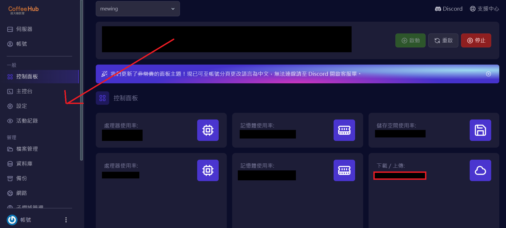

import { Callout } from "fumadocs-ui/components/callout";

1. 下載 [FileZilla](https://filezilla-project.org/download.php?type=client)

2. 完成安裝並開啟 FileZilla

3. 將資訊填入上方欄位

    TW-S 節點主機欄填：`sftp://sftp.coffeehost.net:2024`

    TW-P 節點主機欄填：`sftp://sftp.coffeehost.net:2023`

    MY-1 節點主機欄填：`sftp://proxy.coffeehost.net:2022`

    使用者名稱請至面板點擊 `設定` 查看
    

    密碼和面板密碼相同

4. 點擊快速連線